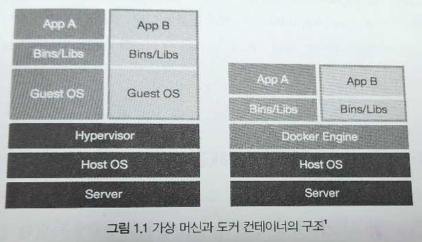

# 01. 도커란?

## 1.1 가상 머신과 도커 컨테이너

#### 기존의 가상화

- 하이퍼바이저를 이용해 여러 개의 운영체제를 하나의 호스트에서 생성해 사용하는 방식
  - 하이퍼바이저란?
    - 하이퍼바이저는 운영 체제의 여러 인스턴스가 동일한 물리적 컴퓨팅 리소스를 공유하여 동시에 실행될 수 있게 하는 소규모 소프트웨어 계층입니다.
    - 이 프로세스를 가상화라고 하며, 운영체제 인스턴스는 물리적 컴퓨터의 소프트웨어 에뮬레이션인 가상 머신(VM)이라고 합니다.
- 여러 개의 운영체제는 가상 머신이라는 단위로 구별된다
- 하이퍼바이저에 의해 생성되고 관리되는 운영체제는 게스트 운영체제 라고 한다
- 게스트 운영체제는 다른 게스트 운영체제와는 완전히 독립된 공간과 시스템 자원을 할당받아 사용한다
- 각종 시스템 자원을 가상화하고 독립된 공간을 생성하는 작업은 하이퍼바이저를 반드시 거치기 때문에 성능의 손실이 발생한다
- 게스트 운영체제를 위한 라이브러리, 커널 등을 전부 포함하기 때문에 가상 머신을 배포하기 위한 이미지로 만들었을 때 이미지의 크기 또한 커진다

#### 도커 컨테이너

- 가상화된 공간을 생성하기 위해 리눅스 자체 기능인 chroot, 네임스페이스, cgroup 을 사용 
  - chroot?
  - 네임스페이스?
  - cgroup?
- 프로세스 단위의 격리 환경을 만들기에 성능 손실이 거의 없다
- 커널은 호스트의 커널을 공유해 사용한다
- 필요한 라이브러리 및 실행 파일만 존재하기 때문에 컨테이너 이미지 용량 또한 대폭 줄어들었다
- 이미지로 배포시 가상머신에 비해 빠르며, 성능 손실이 거의 없다

---

## 1.2 도커를 시작해야 하는 이유

### 1.2.1 애플리케이션의 개발과 배포가 편해집니다.

> 서버를 부팅할 때 실행되는 운영체제를 일반적으로 '호스트 OS' 라고 부른다

- 도커 컨테이너는 호스트 OS 위에서 실행되는 격리된 공간이다. (독립적)
- 컨테이너 내부에서 어떤 작업을 해도 호스트 OS 에는 영향을 끼치지 않는다.
- 독립된 개발 환경을 보장 받을 수 있다
- 서비스를 개발했을 때 사용했던 환경을 다른 서버에서도 컨테이너로서 똑같이 복제할 수 있다
  - 개발/운영 환경의 통합이 가능해진다
- 가상머신에 비해 이미지가 크지 않다
  - 커널을 포함하고 있지 않기 때문에

---

### 1.2.2 여러 애플리케이션의 독립성과 확장성이 높아집니다

- 컨테이너는 수 초 내로 생성, 시작이 가능할 뿐만 아니라 여러 모듈에게 독립된 환경을 동시에 제공할 수 있다
  - 그렇기에, MSA 구조에서 가장 많이 사용되고 있는 가상화 기술이다.
- 도커 컨테이너를 사용하는 이유로 프로젝트 자체의 성숙도나 확장성, 편의성 등도 있다.

---

## 1.3 도커 엔진 설치

### 1.3.1 도커 엔진의 종류 및 버전

- 1개월 마다 릴리즈되는 도커 CE 의 edge 버전은 새로운 기능을 먼저 사용해 볼 수 있다는 장점이 있다
  - 하지만, 각종 버그가 발생할 수 있다
  - 가능하면 도커 CE 의 stable 버전을 사용하는 것을 권장한다

---

### 1.3.2 리눅스 도커 엔진 설치

### 1.3.3 윈도으, 맥 OS 에 도커 설치

### 1.3.4 리눅스 환경에 도커 마련하기

