# 02. 도커 엔진

## 2.1 도커 이미지와 컨테이너

> 도커 엔진에서 사용되는 기분 단위는 이미지와 컨테이너 이다

### 2.1.1 도커 이미지

- 이미지는 도커를 생성할 때 필요한 요소이다.
- iso 파일과 비슷한 개념이다
- 여러 개의 계층으로 된 바이너리 파일로 존재한다
- 컨테이너를 생성하고 실행할 때 읽기 전용으로 사용된다

> 이미지의 이름
> - [저장소 이름]/[이미지 이름]:[태그] 의 형태로 구성되어 있다

- 저장소
  - aws 기준 : 레파지토리

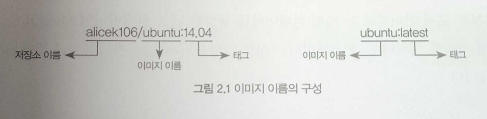

- 저장소 
  - 이미지가 저장된 장소 
- 이미지 이름 
  - 이미지가 어떤 역할을 하는지 나타낸다
- 태그
  - 이미지의 버전관리

---

### 2.1.2 도커 컨테이너

- 도커 컨테이너란?
  - 이미지로 컨테이너를 생성시 이미지의 목적에 맞는 파일이 들어 있는 파일시스템과 격리된 시스템 자원 및 네트워크를 사용할 수 있는 도긻된 공간이 생성된다
- 이미지의 종류에 따라 알맞은 설정과 파일을 가지고 있기 때문에 도커 이미지의 목적에 맞도록 사용되는 것이 일반적이다
- 도커 이미지와 컨테이너는 1:N 관계이다

---

- 컨테이너는 이미지를 읽기전용으로 사용한다
- 이미지에서 변경된 사항만 컨테이너 계층에 저장하므로, 원래 이미지는 영향을 받지 않는다
- 생성된 컨테이너들은 각기 독립된 파일시스템을 제공받는다
- 호스트와 분리돼 있으므로 컨테이너에서 애플리케이션을 삭제하거나 설치해도 다른 컨테이너와 호스트는 변화가 없다

---

## 2.2 도커 컨테이너 다루기

### 2.2.1 컨테이너 생성

#### 버전확인

```shell
docker -v
```  

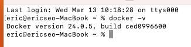

---

#### 컨테이너 생성 1 - run (우분투)

```shell
docker run -i -t ubuntu:14.04
```

- docker run 은 컨테이너를 생성 한다
- ununtu:14.04 는 이미지와 태그
- -i, -t 옵션은 컨테이너와 상호 입출력을 가능하게 한다

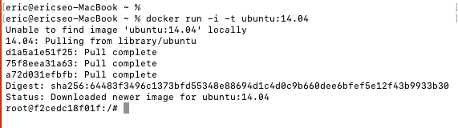

- -i 옵션으로 상호 입출력을, -t 옵션으로 tty 를 활성화 해서 배시(bash) 셸을 사용하도록 컨테이너를 설정했다
  - tty ?
    - Teletypewriter
    - 리눅스의 콘솔 및 터미널을 의미
- 이 두 옵션중 하나라도 사용하지 않으면 셸을 정상적으로 사용할 수 없다

---

#### 컨테이너 내부에서 빠져나오는 방법

1. exit / ctrl + d
   - 컨테이너 내부에서 빠져나오면서 동시에 컨테이너를 정지시킨다.
   - 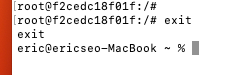
2. ctrl + p, q
   - 컨테이너를 정지하지 않고 빠져나온다
   - 단순히 컨테이너의 셸에서만 빠져나온다

---

#### 이미지 내려받기

```shell
docker pull {이미지:태그}
```

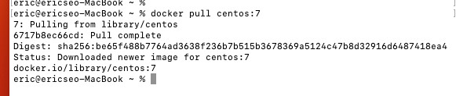

---

#### 이미지 목록 출력

```shell
docker images
```

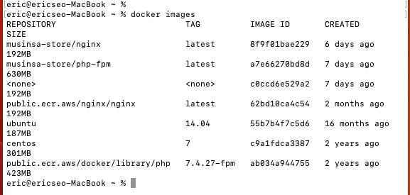

---

#### 컨테이너 생성 2 - create

```shell
docker create -i -t --name mycentos centos:7
```

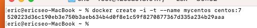

- name 옵션은 컨테이너의 이름을 설정한다
- run 명령어와 달리 컨테이너 내부로 들어가지 않는다
- create 명령어는 컨테이너를 생성할 뿐 들어가진 않는다

---

#### 컨테이너 시작 및 내부로 들어가기

```shell
docker start mycentos
docker attach mycentos 
```

- docker start 명령어는 컨테이너를 시작시킨다
  - 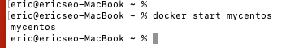
- docker attach 명령어는 컨테이너 내부로 들어간다
  - 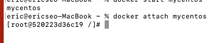
- run 명령어는 pull, create, start 명령어를 일괄적으로 실행한 후 attach 가 가능한 컨테이너라면 컨테이너 내부로 들어간다
- create 명령어는 pull 한 후 컨테이너를 생성만 한다

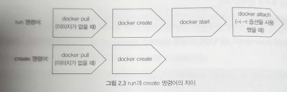

> 컨테이너를 대상으로 하는 모든 명령어는 컨테이너의 이름 대신 ID 를 쓸 수 있다 <br/>
> ex) docker start dd894490df

---

### 2.2.2 컨테이너 목록 확인

```shell
docker ps 
```

- docker ps
  - 옵션 없이 사용할 경우, 현재 실행중인 컨테이너 목록 출력
    - 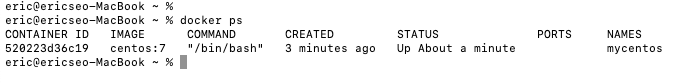
  - -a 옵션 사용시, 모든 컨테이너 목록 출력
    - 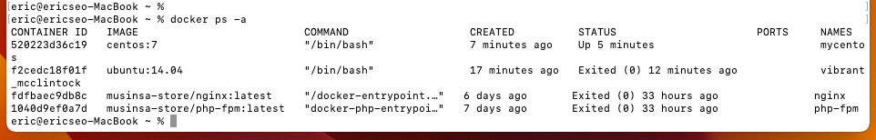

#### docker ps 목록 항목

- CONTAINER ID
  - 컨테이너에 자동으로 할당되는 고유한 ID
- IMAGE
  - 컨테이너를 생성할 때 사용된 이미지 이름
- COMMAND
  - 컨테이너가 시작될 때 실행될 명령어
  - docker run 이나 create 명령어의 맨 끝에 입력해서 컨테이너를 생성할 때 덮어쓸 수 있다.
    - ex) ```docker run -i -t ubuntu:14.04 echo hello world!```
- CREATED
  - 컨테이너가 생성되고 난 뒤 흐른 시간
- STATUS
  - 컨테이너 상태
  - UP : 실행중
  - Exited : 종료
  - Pause : 일시정지
- PORTS
  - 호스트와 연결한 포트
- NAMES
  - 컨테이너 고유 이름
  - --name 옵션으로 이름을 설정하지 않으면 임의로 설정된다
  - rename 명령어를 사용하면 이름을 변경할 수 있다
    - ex) ```docker rename angry_morse my_container```

---

### 2.2.3 컨테이너 삭제 

#### 컨테이너 정지/삭제

```shell
docker stop mycentos
docker rm mycentos
```

- docker rm 명령어는 실행중인 컨테이너는 삭제할 수 없다 (에러발생)
  - 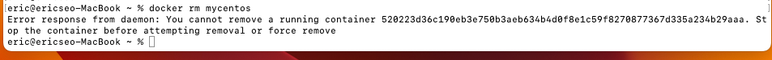
- docker stop 명령어로 정지 후 삭제해야 한다
- 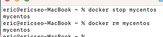
- -f 옵션을 사용하면 실행중인 컨테이너도 삭제가 가능하다

#### 모든 컨테이너 삭제

```shell
docker conmtainer prune
```

- prune 명령어를 사용하면 모든 컨테이너를 삭제할 수 있다
- docker ps 명령어의 -a 옵션과 -q 옵션을 조합해 삭제할 수도 있다
  - -a : 모든 컨테이너
  - -q : 컨테이너의 ID 만 출력
  - 위 옵션들을 사용해 출력된 컨테이너 리스트를 변수로 컨테이너를 삭제하면 모든 컨테이너를 간단히 삭제할 수 있다

```shell
docker stop ${docker ps -a -q}
docker rm ${docekr ps -a -q}
```

---

### 2.2.4 컨테이너를 외부에 노출

- 컨테이너는 가상 IP 주소를 할당받는다
- 기본적으로 도커는 컨테이너에 172.17.0.x 의 IP 를 순차 할당한다
- ifconfig 명령어로 컨테이너의 네트워크 인터페이스를 확인할 수 있다

```shell
docker run -i -t --name network_test ubuntu:14.04

~:# ifconfig
```

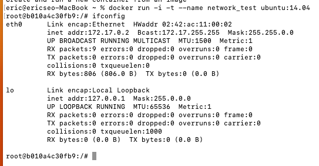

- 아무런 설정을 하지 않았다면 이 컨테이너는 외부에서 접근할 수 없으며, 호스트에서만 접근할 수 있다
- 외부에 컨테이너의 애플리케이션을 노출하기 위해서는 eth0 의 IP 와 포트를 호스트의 IP 와 포트에 바인딩해야 한다

---

#### 호스트와 IP, 포트 바인딩

```shell
docker run -i -t --name mywebserver -p 80:80 ubuntu:14.04
```

- -p : 컨테이너의 포트를 호스트의 포트와 바인딩
  - [호스트의 포트][컨테이너의 포트]
  - 여러 개의 포트를 외부에 개방하려면 -p 옵션을 여러번 사용한다
  - ex) ```docker run -i -t -p 3306:3306 -p 192.168.0.100:7777:80 ununtu:14.04```

#### 아파치 웹 서버 설치

```shell
~:# apt-get update
~:# apt-get install apache2 -y
~:# service apache2 start 
```

- 호스트의 ip 및 port 로 접근
  - 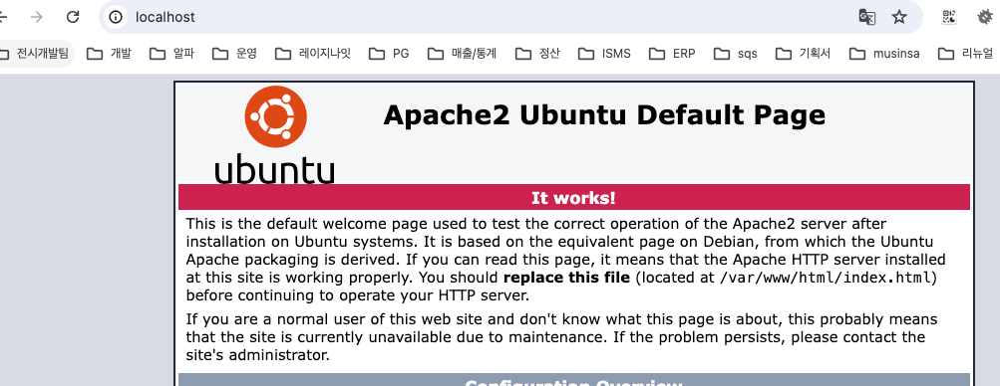

---

### 2.2.5 컨테이너 애플리케이션 구축

- 컨테이너화 할 때 여러 개의 애플리케이션을 한 컨테이너에 설치할 수도 있다
  - 권장하지 않는다.
- 한 컨테이너에 프로세스 하나만 실행하는 것이 도커의 철학이다
  - 관리에 용이성

---

#### 워드프레스 기반 블로그를 만들어보자

```shell
docker run -d --name wordpressdb -e MYSQL_ROOT_PASSWORD=password -e MYSQL_DATABASE=wordpress --platform linux/amd64 mysql:5.7
```

- 실행시 에러 발생
  - 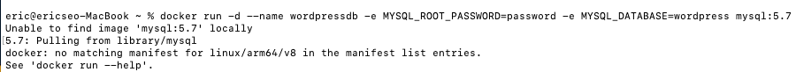
- --platform linux/amd64 추가


```shell
docker run -d -e WORDPRESS_DB_HOST=mysql -e WORDPRESS_DB_USER=root -e WORDPRESS_DB_PASSWORD=password --name wordpress --link wordpressdb:mysql -p 80 wordpress
```

#### 호스트와 바인됭 포트를 확인

```shell
docker port wordpress
```

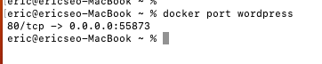

- 호스트 IP 와 바인딩된 포트로 접근
  - 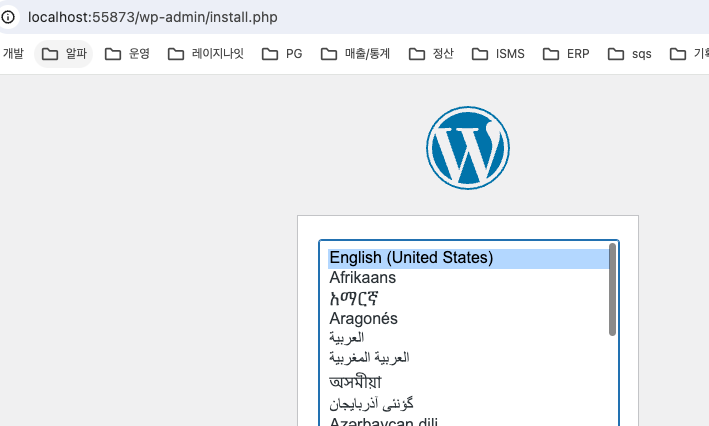

---

#### run 추가 옵션

- -d
  - 컨테이너를 백그라운드에서 실행 (Detached 모드)
  - Detached 모드의 컨테이너는 반드시 프로그램이 실행되어야 한다.
    - 포그라운드 프로그램이 실행되지 않으면 컨테이너는 종료된다
- -e
  - 컨테이너 내부의 환경변수를 설정
  - 리눅스에서 환경변수를 확인하는 가장 간단한 방법은 echo 를 사용하는 것이다
  - ```echo ${ENVIROMENT_NAME}```
  - 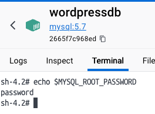
  - exec 명령어를 사용하면 컨테이너 내부의 셸을 사용할 수 있다
    - ```docker exec -i -t wordpressdb /bin/bash```
    - ```echo $MYSQL_ROOT_PASSWORD```
    - 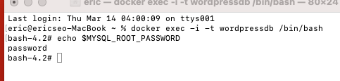
- --link
  - 내부 IP 를 알 필요 없이 항상 컨테이너에 별명으로 접근하도록 설정한다
  - 위에서는 wordpressdb 컨테이너를 mysql 이라는 이름으로 설정했다.
  - 워드프레스 웹서버 컨테이너는 wordpressdb 의 ip 를 몰라도 mysql 이라는 호스트명으로 접근할 수 있다
  - 워드프레스 웹 서버 컨테이너에서 mysql 이라는 호스트 이름으로 요청을 전송하면 wordpressdb 컨테이너의 내부 ip 로 접근하는 것을 확인할 수 있다
    - ```docker exec wordpress curl mysql:3306 --silent```
  - --link 에 입력된 컨테이너가 실행 중이지 않거나 존재하지 않는다면 --link 를 적용한 컨테이너 또한 실행할 수 없다
  - wordpressdb 가 종료된 상태에서 wordpress 를 실행하면 아래와 같은 에러가 발생한다
    - 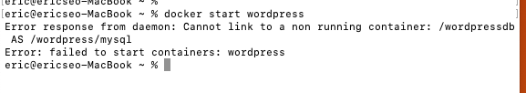
  - Deprecated 될 예정
    - 브릿지 네트워크를 사용하는 것을 권장한다

---

- 비밀번호처럼 민감한 정보는 환경변수로 설정하면 위험하다
- 도커 스웜 모드의 secret 이나 쿠버네티스의 secret 과 같은 기능을 활용하는 것이 좋다
  - 도커 스웜 secret 참고
    - https://seongjin.me/docker-swarm-secret/
